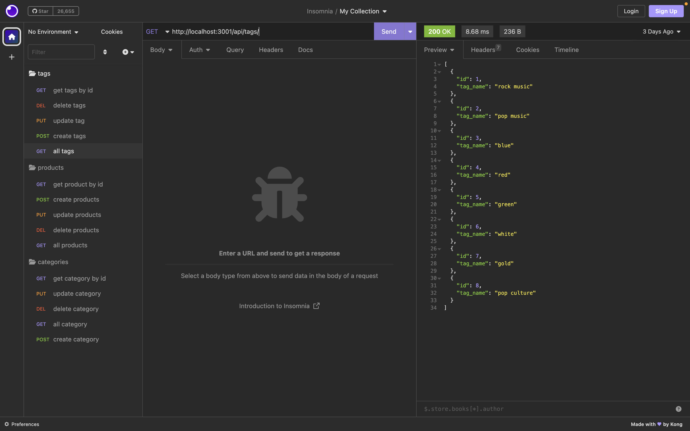

# week-13-E-Commerce-Back-End

Customer asked for a way to see products in the back end being able to update, add and delete catergories, products on tags through the back end routes.
## User Story

- As a developer I want a application that works with the backend to be enable a user to see the all of their product stock in the back end of their application and make changes.

- So that the user is able to see all information on the products in the back end using insomnia 

## Acceptance Criteria

- WHEN I am able to connect my database to sequlize

- WHEN I am able to enter schema, seed command and run my sever

- WHEN I use insomnia the data appears with the seeded data 

- WHEN I  can successfully open api get all routes and specific ids to show

- WHEN I am able to test POST, GET, DELETE AND PUT ROUTES in insomnia

- WHEN I am able to my make changes to my routes in insomnia

 
 

 

## General info
This is a page developed through Java Script, sequlize and later loaded up through insomnia. The functionality through insomnia allows the user to manipulate routes created allowing for delete, update and post through the back end. The user is presented with insomnia which they can view all products, tags and categories in the page

## Page link

## MY WEB PAGE
User opens insomnia and is presented with all routes folders POST, GET, GET/ID, DELETE and PUT
